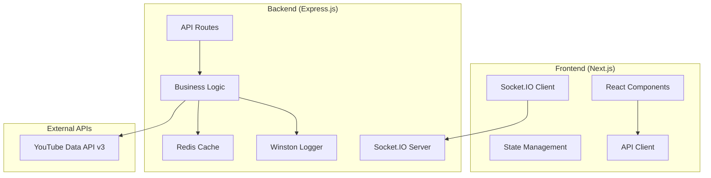
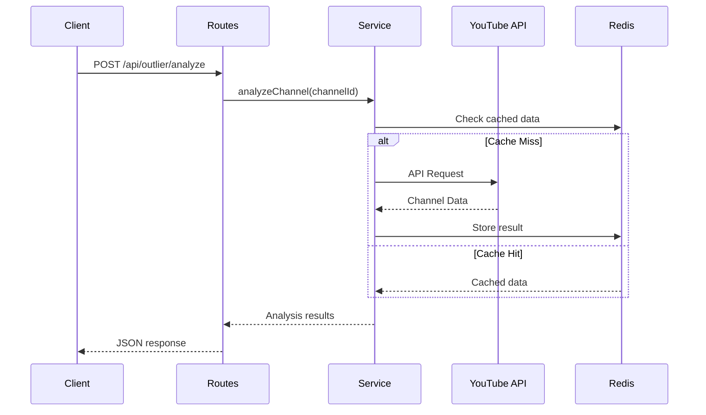
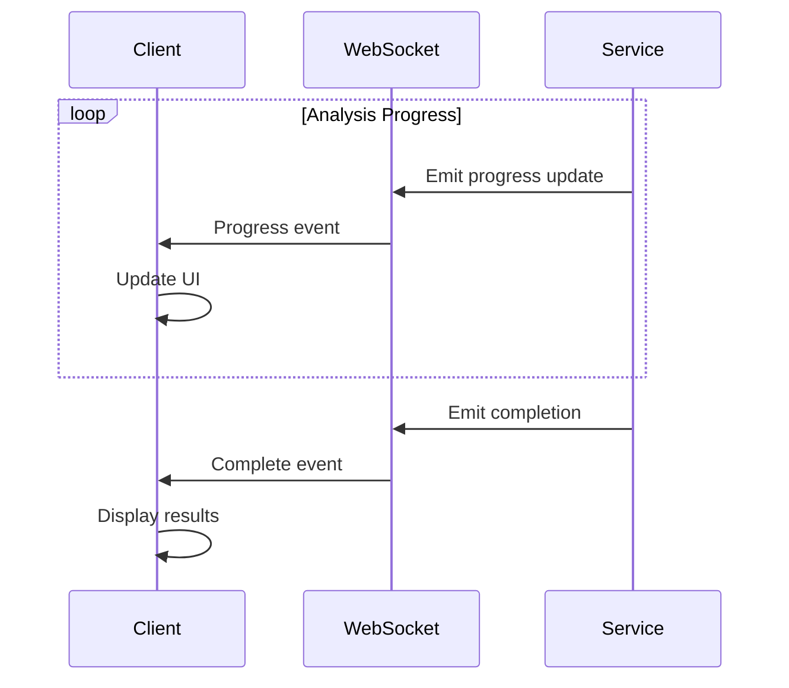

# System Patterns - YouTube Outlier Discovery Tool

## Overall Architecture

### High-Level System Design



### Service-Oriented Architecture

**Core Principle**: Separation of concerns through distinct service layers

```
Client Request → Routes → Controllers → Services → External APIs/Cache
                   ↓
            Real-time Updates (Socket.IO)
```

## Backend Architecture Patterns

### 1. Service Layer Pattern

**Implementation**: [`server/src/services/`](server/src/services/)

```javascript
// Centralized business logic
class OutlierDetectionService {
  async analyzeChannel(channelId, options) {
    // Pure business logic, no HTTP concerns
    // Coordinates with YouTube API and caching
  }
}

class YouTubeService {
  async getChannelVideos(channelId, maxResults) {
    // YouTube API abstraction
    // Handles quota management and rate limiting
  }
}
```

**Benefits**:
- Business logic isolated from HTTP layer
- Testable and reusable across different interfaces
- Clear separation between API calls and data processing

### 2. Caching Strategy Pattern

**Redis Implementation**: [`server/src/services/youtubeService.js:25-45`](server/src/services/youtubeService.js:25)

```javascript
const cacheKey = `channel_videos_${channelId}_${maxResults}_${publishedAfter}`;
const cached = await redisClient.get(cacheKey);

if (cached) {
  return JSON.parse(cached);
}

// Fetch from API
const result = await this.apiCall();
await redisClient.setex(cacheKey, 21600, JSON.stringify(result)); // 6 hours
```

**Cache Hierarchy**:
- **L1**: In-memory analysis results (temporary)
- **L2**: Redis cache for API responses (persistent)
- **L3**: YouTube API (external)

### 3. Real-time Communication Pattern

**WebSocket Architecture**: [`server/src/routes/outlier.js:45-65`](server/src/routes/outlier.js:45)

```javascript
// Progress tracking during long-running operations
const emitProgress = (stage, progress, data = {}) => {
  req.io.emit('analysisProgress', {
    analysisId: req.body.analysisId,
    stage,
    progress,
    timestamp: new Date().toISOString(),
    ...data
  });
};
```

**Communication Flow**:
1. Client initiates analysis via REST API
2. Server returns immediate acknowledgment
3. Progress updates sent via WebSocket
4. Final results available via both WebSocket and REST

### 4. Error Handling Pattern

**Graceful Degradation**: [`server/src/services/youtubeService.js:100-120`](server/src/services/youtubeService.js:100)

```javascript
try {
  // Primary operation
  return await this.primaryMethod();
} catch (error) {
  logger.warn('Primary method failed, attempting fallback', { error });
  
  try {
    // Fallback operation
    return await this.fallbackMethod();
  } catch (fallbackError) {
    logger.error('All methods failed', { error, fallbackError });
    throw new ServiceError('Operation failed after all retries');
  }
}
```

## Frontend Architecture Patterns

### 1. Component Composition Pattern

**Structure**: [`client/components/YouTubeOutlierApp.tsx:50-100`](client/components/YouTubeOutlierApp.tsx:50)

```typescript
const YouTubeOutlierApp = () => {
  return (
    <div className="container">
      <AnalysisForm onSubmit={handleAnalysis} />
      <ProgressTracker progress={analysisProgress} />
      <ResultsDisplay results={analysisResults} />
    </div>
  );
};
```

**Benefits**:
- Reusable components
- Clear data flow
- Easy testing and maintenance

### 2. State Management Pattern

**Centralized State**: [`client/components/YouTubeOutlierApp.tsx:20-40`](client/components/YouTubeOutlierApp.tsx:20)

```typescript
interface AnalysisState {
  isAnalyzing: boolean;
  progress: ProgressData;
  results: OutlierResult[];
  error: string | null;
}

const [state, setState] = useState<AnalysisState>({
  isAnalyzing: false,
  progress: { stage: '', progress: 0 },
  results: [],
  error: null
});
```

**State Flow**:
- Form submission triggers analysis
- Progress updates from WebSocket
- Results update from API response
- Error states handled gracefully

### 3. Real-time Integration Pattern

**Socket.IO Integration**: [`client/components/YouTubeOutlierApp.tsx:200-250`](client/components/YouTubeOutlierApp.tsx:200)

```typescript
useEffect(() => {
  const socket = io(API_BASE_URL);
  
  socket.on('analysisProgress', (data) => {
    setAnalysisProgress(data);
  });
  
  socket.on('analysisComplete', (data) => {
    setAnalysisResults(data.results);
    setIsAnalyzing(false);
  });
  
  return () => socket.disconnect();
}, []);
```

## Data Flow Patterns

### 1. Request-Response Flow



### 2. Real-time Progress Flow



## API Design Patterns

### 1. RESTful Resource Design

**Endpoint Structure**:
```
POST /api/outlier/analyze          # Start analysis
GET  /api/outlier/results/:id      # Get results
GET  /api/channels/:id/videos      # Get channel videos
GET  /api/channels/search          # Search channels
```

**Response Format**:
```json
{
  "success": true,
  "data": { /* actual data */ },
  "meta": {
    "timestamp": "2025-01-08T10:00:00Z",
    "apiQuotaUsed": 250,
    "cacheHit": true
  },
  "error": null
}
```

### 2. Input Validation Pattern

**Express Validator Integration**: [`server/src/routes/outlier.js:15-30`](server/src/routes/outlier.js:15)

```javascript
const validateAnalysisInput = [
  body('competitorChannels').isArray().notEmpty(),
  body('maxResults').isInt({ min: 10, max: 50 }),
  body('daysBack').isInt({ min: 1, max: 30 }),
  
  (req, res, next) => {
    const errors = validationResult(req);
    if (!errors.isEmpty()) {
      return res.status(400).json({
        success: false,
        error: 'Validation failed',
        details: errors.array()
      });
    }
    next();
  }
];
```

## Performance Optimization Patterns

### 1. Quota Management Pattern

**YouTube API Quota Tracking**: [`server/src/services/youtubeService.js:150-170`](server/src/services/youtubeService.js:150)

```javascript
class QuotaManager {
  constructor() {
    this.dailyLimit = 10000;
    this.usedQuota = 0;  // TODO: Persist to Redis
  }
  
  async checkQuota(requiredUnits) {
    if (this.usedQuota + requiredUnits > this.dailyLimit) {
      throw new QuotaExceededError('Daily quota limit reached');
    }
  }
  
  recordUsage(units) {
    this.usedQuota += units;
  }
}
```

### 2. Batch Processing Pattern

**Video Statistics Batching**: [`server/src/services/youtubeService.js:75-95`](server/src/services/youtubeService.js:75)

```javascript
async getVideoStatistics(videoIds) {
  const batches = this.chunkArray(videoIds, 50); // API limit
  const results = [];
  
  for (const batch of batches) {
    const batchResults = await this.youtube.videos.list({
      part: 'statistics',
      id: batch.join(',')
    });
    
    results.push(...batchResults.data.items);
    await this.delay(100); // Rate limiting
  }
  
  return results;
}
```

### 3. Memory Management Pattern

**Temporary Storage for Analysis**: [`server/src/routes/outlier.js:150-170`](server/src/routes/outlier.js:150)

```javascript
// In-memory storage for active analyses
const analysisResults = new Map();

// Cleanup completed analyses after 1 hour
const CLEANUP_INTERVAL = 3600000;
setInterval(() => {
  const cutoff = Date.now() - CLEANUP_INTERVAL;
  for (const [id, result] of analysisResults.entries()) {
    if (result.timestamp < cutoff) {
      analysisResults.delete(id);
    }
  }
}, CLEANUP_INTERVAL);
```

## Security Patterns

### 1. Input Sanitization Pattern

**Request Validation**: All inputs validated and sanitized
```javascript
// Channel ID validation
const isValidChannelId = (id) => /^UC[a-zA-Z0-9_-]{22}$/.test(id);

// Search query sanitization
const sanitizeQuery = (query) => query.replace(/[^\w\s-]/g, '').trim();
```

### 2. Rate Limiting Pattern

**Express Rate Limit**: [`server/src/middleware/rateLimiter.js`](server/src/middleware/rateLimiter.js) (Planned)

```javascript
const rateLimit = require('express-rate-limit');

const analysisLimiter = rateLimit({
  windowMs: 15 * 60 * 1000, // 15 minutes
  max: 5, // 5 analyses per window
  message: 'Too many analysis requests, please try again later'
});
```

## Error Handling Patterns

### 1. Centralized Error Handler

**Global Error Middleware**: [`server/src/middleware/errorHandler.js`](server/src/middleware/errorHandler.js) (Planned)

```javascript
const errorHandler = (err, req, res, next) => {
  logger.error('API Error', {
    error: err.message,
    stack: err.stack,
    url: req.url,
    method: req.method
  });
  
  if (err.name === 'QuotaExceededError') {
    return res.status(429).json({
      success: false,
      error: 'API quota exceeded, please try again later'
    });
  }
  
  res.status(500).json({
    success: false,
    error: 'Internal server error'
  });
};
```

### 2. Circuit Breaker Pattern

**API Failure Protection**: (Planned for production)

```javascript
class CircuitBreaker {
  constructor(threshold = 5, resetTime = 60000) {
    this.failureThreshold = threshold;
    this.resetTime = resetTime;
    this.failureCount = 0;
    this.state = 'CLOSED'; // CLOSED, OPEN, HALF_OPEN
  }
  
  async execute(operation) {
    if (this.state === 'OPEN') {
      throw new Error('Circuit breaker is OPEN');
    }
    
    try {
      const result = await operation();
      this.onSuccess();
      return result;
    } catch (error) {
      this.onFailure();
      throw error;
    }
  }
}
```

## Testing Patterns (Planned)

### 1. Service Layer Testing

```javascript
describe('OutlierDetectionService', () => {
  beforeEach(() => {
    // Mock YouTube API responses
    // Setup test data
  });
  
  it('should detect outliers correctly', async () => {
    const result = await outlierService.detectOutliers(mockVideos);
    expect(result.outliers).toHaveLength(3);
    expect(result.outliers[0].score).toBeGreaterThan(30);
  });
});
```

### 2. Integration Testing

```javascript
describe('Outlier Analysis API', () => {
  it('should complete full analysis workflow', async () => {
    const response = await request(app)
      .post('/api/outlier/analyze')
      .send(validAnalysisRequest);
      
    expect(response.status).toBe(200);
    expect(response.body.success).toBe(true);
  });
});
```

## Monitoring Patterns (Planned)

### 1. Performance Metrics

```javascript
const performanceTracker = {
  trackApiCall: (endpoint, duration, quotaUsed) => {
    metrics.histogram('api_duration', duration, { endpoint });
    metrics.counter('quota_usage', quotaUsed, { endpoint });
  },
  
  trackCacheHit: (key, hit) => {
    metrics.counter('cache_requests', 1, { key, hit: hit ? 'true' : 'false' });
  }
};
```

### 2. Health Check Pattern

```javascript
app.get('/health', async (req, res) => {
  const health = {
    status: 'healthy',
    timestamp: new Date().toISOString(),
    services: {
      redis: await checkRedisHealth(),
      youtube: await checkYouTubeAPIHealth(),
      memory: process.memoryUsage()
    }
  };
  
  res.json(health);
});
```

---

**Last Updated**: 2025-01-08  
**Architecture Review**: 2025-01-08  
**Confidence Rating**: 9/10